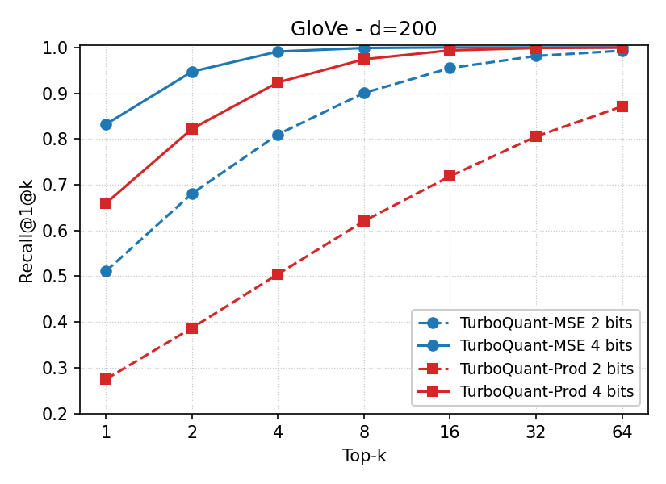

# TurboQuant Quantization Benchmark

Benchmarks for the **TurboQuant** family of vector quantizers — TQ-MSE and TQ-Prod — on similarity-search datasets, plus a focused reproduction of the **GloVe-200** panel of Figure 5 from the paper (Section 4.4, *Near Neighbour Search Experiments*).

Paper: Zandieh, Daliri, Hadian, Mirrokni — *TurboQuant: Online Vector Quantization with Near-optimal Distortion Rate*.

---

## Reproducing Fig. 5(a) — GloVe d=200



### Result table (Recall@1@k, nb=100,000, nq=10,000)

| method        | k=1   | k=2   | k=4   | k=8   | k=16  | k=32  | k=64  |
|:--------------|:------|:------|:------|:------|:------|:------|:------|
| TQ-MSE-2bit   | 0.5112 | 0.6807 | 0.8101 | 0.9006 | 0.9550 | 0.9814 | 0.9929 |
| TQ-Prod-2bit  | 0.2751 | 0.3870 | 0.5047 | 0.6206 | 0.7185 | 0.8054 | 0.8712 |
| **TQ-MSE-4bit**   | **0.8323** | **0.9472** | **0.9911** | **0.9988** | 1.0000 | 1.0000 | 1.0000 |
| TQ-Prod-4bit  | 0.6598 | 0.8223 | 0.9238 | 0.9742 | 0.9936 | 0.9987 | 0.9996 |

Raw CSV: [`result/reproduce_fig5_glove_nb100000_nq10000.csv`](result/reproduce_fig5_glove_nb100000_nq10000.csv)

The paper's Fig. 5(a) y-axis starts at 0.5; only the **TQ-MSE** lines fit in that range, so the curves labelled *"TurboQuant 2 bits / 4 bits"* in the paper are TQ-MSE. (TQ-Prod is plotted here for completeness; see *Which variant is "TurboQuant"?* below.)

### Dataset (GloVe-200)

| Field | Value |
|---|---|
| Source | ann-benchmarks `glove-200-angular` |
| Download URL | `http://ann-benchmarks.com/glove-200-angular.hdf5` |
| Local path (gitignored) | `data/glove-200-angular.hdf5` |
| File size | 962,819,488 bytes (~918 MB) |
| Format | HDF5 |

Built from `glove.twitter.27B.200d.txt` (1.2 M tokens × 200 dims). This is the only standard GloVe distribution that simultaneously matches the paper's two hard constraints: **d = 200** and a **pre-existing 10,000-vector query set**.

#### HDF5 layout

```
keys:       ['distances', 'neighbors', 'test', 'train']
train:      (1,183,514, 200) float32
test:       (10,000, 200) float32
neighbors:  (10,000, 100) int32       # ground-truth top-100 of test vs train
distances:  (10,000, 100) float32
attrs:      {'distance': 'angular'}
```

Vectors are **not** L2-normalised in the file (`||x||` ≈ 5–8). The encoder normalises internally and stores `||x||` separately, so raw vectors can be passed in directly.

#### How to download

```bash
mkdir -p data && cd data
wget -c http://ann-benchmarks.com/glove-200-angular.hdf5
```

### Base / query split

Naming follows the ann-benchmarks / FAISS convention:
- `nb` = **n**umber of **b**ase vectors (size of the database we search against)
- `nq` = **n**umber of **q**uery vectors

| Split | Source split | Size | How |
|---|---|---|---|
| **Base / db** (`nb`) | `train` (1,183,514 × 200) | **100,000** | `np.random.default_rng(seed=42).choice(1183514, size=100000, replace=False)`, then `np.sort(...)` for cache-friendly HDF5 read |
| **Query** (`nq`) | `test` (10,000 × 200) | **10,000** | take all of `test` (no subsampling) |

Implemented in `benchmark_quant.py:read_hdf5_split()`. Sizes match paper §4.4 exactly:
> we randomly sample 100,000 data points … For the GloVe dataset, we use a pre-existing query set consisting of 10,000 points.

The base index set is deterministic given `seed=42` — re-running reads the *same* 100,000 GloVe vectors every time.

### How to run

```bash
python benchmark_quant_reproduce.py --dataset glove --nb 100000 --nq 10000 --bits 2 4
python plot_fig5.py
```

Outputs:
- `result/reproduce_fig5_glove_nb100000_nq10000.csv` — Recall@1@k for k ∈ {1, 2, 4, 8, 16, 32, 64}
- `result/reproduce_fig5_glove.png` — Fig. 5(a)-style curves

### Metric

`Recall@1@k` (paper's "1@k") under inner product:

```
true_top1 = argmax_i  <q, x_i>
recall@1@k = mean_q [ true_top1 ∈ top-k of approx_IP(q, ·) ]
```

Implemented in `benchmark_quant_reproduce.py:recall_at_1_at_k()`. Ranking is by **raw IP** (not cosine), per paper §4.4:
> how often the **true top inner product result** is captured within the top-k approximated results.

### Which variant is "TurboQuant"?

Paper §4.4 just says "TurboQuant" — no `mse` / `prod` suffix. But Fig. 5(a)'s y-axis starts at 0.5, while our TQ-Prod-2bit at k=1 = 0.275 (well below the chart). Only TQ-MSE fits the figure. Numerically, TQ-MSE-2bit @ k=1 ≈ 0.51 (matches the figure's 2-bit line at the y-axis) and TQ-MSE-4bit @ k=1 ≈ 0.83 (matches the 4-bit line). So **the paper's "TurboQuant" in Fig. 5 is the MSE variant.**

This is not contradicted by §4.1 ("TurboQuantprod performs better at lower bit ratios … for inner product *estimation*") because §4.1 measures regression error of IP, while Fig. 5 measures *ranking* recall — for ranking, low variance (MSE) beats unbiasedness (Prod) at low bit-widths. See *Key Findings* below.

### Reproducibility caveat

The paper does **not** publish a random seed for "randomly sample 100,000", and the authors have not released code (verified by reading every page of the PDF and grepping public TurboQuant forks). The 100,000 base vectors we sample with `seed=42` are therefore a **different random subset** of the 1,183,514-vector pool than the paper's. 100,000 is large enough that Recall@1@k variance across seeds is typically well under 1 percentage point, and the 10,000 queries are identical to the paper's (canonical `test` split).

For confidence intervals, run with multiple seeds:
```bash
for s in 0 1 2 3 42; do
  python benchmark_quant_reproduce.py --bits 2 4 --seed $s \
      --output result/reproduce_fig5_glove_seed${s}.csv
done
```
(`--seed` controls TurboQuant's rotation/QJL seed; the HDF5 sub-sampling seed is hard-coded to 42 in `read_hdf5_split` — change it there if needed.)

---

## Methods

Both methods share the same preprocessing pipeline:

1. **Normalize:** decompose each vector as $x = \|x\| \cdot \hat{x}$, storing the norm $\|x\|$ separately.
2. **Random rotation:** apply a Haar-distributed random orthogonal matrix $\Pi$ so each coordinate of $y = \Pi \hat{x}$ becomes approximately i.i.d. $\mathcal{N}(0, 1/d)$ for large $d$.
3. **Scalar quantization:** quantize each rotated coordinate $y_i$ independently using Lloyd-Max optimal centroids derived from the known Gaussian distribution (data-oblivious — no training data needed).

### TQ-MSE (MSE-optimal)

All $b$ bits per dimension are allocated to MSE-optimal scalar quantization. Each coordinate $y_i$ is mapped to the nearest centroid $c_{k_i}$ from a $2^b$-level codebook, producing a quantized vector $\hat{y}$.

Inner product estimation via full reconstruction:

$$\langle q, x \rangle_{\text{approx}} = \|x\| \cdot \langle q, \Pi^T \hat{y} \rangle = \|x\| \cdot \langle \Pi q, \hat{y} \rangle$$

**Properties:** Minimises reconstruction MSE $\mathbb{E}[\|x - \tilde{x}\|^2]$. The IP estimate is **biased** — it systematically under-estimates inner products. Storage: $b \cdot d$ bits (indices) + 32 bits (norm).

### TQ-Prod (IP-unbiased via QJL correction)

Allocates $(b-1)$ bits to MSE quantization and 1 bit to a **Quantized Johnson–Lindenstrauss (QJL)** residual correction, achieving an unbiased inner product estimator.

**Encoding:**
1. Quantise $\hat{x}$ with $(b-1)$-bit TQ-MSE, yielding $\tilde{x}_{\text{mse}}$.
2. Compute residual $r = \hat{x} - \tilde{x}_{\text{mse}}$ and store its norm $\|r\|$.
3. Project the residual through a random Gaussian matrix $S \in \mathbb{R}^{d \times d}$ and store only the signs: $s = \text{sign}(S \cdot r)$.

Inner product estimation with two-stage correction:

$$\langle q, x \rangle_{\text{approx}} = \|x\| \cdot \left( \underbrace{\langle \Pi q, \hat{y} \rangle}_{\text{MSE part}} + \underbrace{\sqrt{\frac{\pi}{2}} \cdot \frac{\|r\|}{d} \cdot \langle S q, s \rangle}_{\text{QJL residual correction}} \right)$$

**Properties:** Achieves $\mathbb{E}[\langle q, x \rangle_{\text{approx}}] = \langle q, x \rangle$ (unbiased). Storage: $(b-1) \cdot d$ bits (MSE indices) + $d$ bits (QJL signs) + 32 bits (residual norm) + 32 bits (norm).

---

## Datasets

| Dataset | Dim | Domain | Format |
|---------|-----|--------|--------|
| **GloVe-200** *(Fig. 5 reproduction)* | 200 | Word embeddings, ann-benchmarks | hdf5 |
| **SIFT** | 128 | SIFT local image descriptors | fvecs |
| **Deep** | 96 | Deep learning embeddings (Yandex Deep1B) | fvecs |
| **BigANN** | 128 | SIFT descriptors (BigANN) | bvecs |
| **GIST** | 960 | GIST global image descriptors | fvecs |
| **MS MARCO** | 1024 | Passage retrieval embeddings | fvecs |
| **OpenAI** | 1536 | OpenAI text embeddings | fvecs |

Dataset paths are configured in `benchmark_quant.py:DATASETS`. Most use a shared `DATA_ROOT` of `/data/cpanourg/2-hdvc/data`; GloVe is read from `data/glove-200-angular.hdf5` relative to the repo root.

---

## Evaluation Metrics

The general benchmark script `benchmark_quant.py` computes the following on `nb × nq` distance pairs (`nb=10000`, `nq=1000` by default; the Fig. 5 reproduction script uses `nb=100000`, `nq=10000`). L2 distance estimation uses exact norms: $\hat{L}_2^2(q, x) = \|q\|^2 + \|x\|^2 - 2 \cdot \widehat{\langle q, x \rangle}$, so the only source of approximation error is the inner product estimator.

| Metric | Formula | Interpretation |
|--------|---------|----------------|
| **Distortion** | $\frac{1}{n}\sum_i \|x_i - \tilde{x}_i\|^2$ | Mean squared reconstruction error. Lower is better. |
| **L2-RelErr** (mean) | $\frac{1}{n \cdot m}\sum_{i,j} \frac{\lvert \hat{L}_2^2(q_j, x_i) - L_2^2(q_j, x_i) \rvert}{L_2^2(q_j, x_i)}$ | Mean relative error of squared L2 distance estimation. |
| **IP-RelErr** (mean) | $\frac{1}{n \cdot m}\sum_{i,j} \frac{\lvert \widehat{\langle q_j, x_i \rangle} - \langle q_j, x_i \rangle \rvert}{\lvert \langle q_j, x_i \rangle \rvert}$ | Mean relative error of inner product estimation. |
| **L2-R@K** | $P(\text{true L2-NN} \in \text{top-}K \text{ by approx L2})$ | Recall@K under L2 distance. |
| **IP-R@K** | $P(\text{true IP-NN} \in \text{top-}K \text{ by approx IP})$ | Recall@K under inner product. |
| **R@1@k** | $P(\text{true top-1-by-IP} \in \text{top-}k \text{ by approx IP})$ | Used by Fig. 5 reproduction. Paper's "1@k". |

Median variants of RelErr are also reported in the CSV for robustness.

---

## Key Findings (general benchmark)

**1. TQ-MSE dominates at low bit-widths (1–6 bit/dim).** At the same total bits per dimension, TQ-MSE achieves lower distortion, lower relative error, and higher recall. TQ-Prod sacrifices 1 bit to QJL, leaving only $(b-1)$ bits for MSE — a significant penalty when the budget is small.

**2. TQ-Prod catches up at high bit-widths (≥ 8 bit/dim).** As the bit budget grows, the 1-bit QJL overhead becomes minor and unbiased IP estimation provides better ranking. On SIFT: at 9 bit/dim TQ-Prod L2-R@1 = 0.933 vs TQ-MSE 0.906; at 12 bit/dim 0.980 vs 0.973.

**3. Higher dimensionality helps both methods.** The Gaussian approximation underlying the codebook becomes more accurate as $d$ grows. L2-R@1 at 4 bit/dim: Deep (d=96) 0.770, SIFT (d=128) 0.505, GIST (d=960) 0.612, MS MARCO (d=1024) 0.888, OpenAI (d=1536) 0.833. (SIFT/BigANN are unnormalised integer descriptors, which dampens the dimension effect.)

**4. TQ-Prod's distortion is always higher, but its Recall@1 can be higher.** Distortion measures per-vector reconstruction; recall measures ranking across the database. Unbiased IP estimation produces better relative ordering despite larger per-element noise — at higher bit-widths where variance is small enough that unbiasedness matters more.

**5. Recall@10 and Recall@100 saturate quickly.** Recall@10 reaches 1.0 by 6–7 bit/dim and Recall@100 by 4–5 bit/dim on most datasets. The main differentiator is Recall@1, which keeps improving up to 12 bit/dim.

---

## Usage

### Fig. 5 reproduction (GloVe only, R@1@k)

```bash
python benchmark_quant_reproduce.py --dataset glove --nb 100000 --nq 10000 --bits 2 4
python plot_fig5.py
```

`benchmark_quant_reproduce.py` options:
- `--dataset`: defaults to `glove`
- `--nb`, `--nq`: defaults to paper's 100,000 / 10,000
- `--bits`: defaults to `[2, 4]` (paper's two bit-widths)
- `--ks`: defaults to `[1, 2, 4, 8, 16, 32, 64]` (paper's top-k axis)
- `--variant`: `mse`, `prod`, or `both` (default `both`)
- `--seed`: TurboQuant rotation/QJL seed (default 42)
- `--output`: custom CSV path

### General benchmark (multi-bit sweep, 6 datasets)

```bash
python benchmark_quant.py --dataset sift --bits 1 2 3 4 5 6 7 8 9 10 11 12
```

Options:
- `--dataset`: one of `sift`, `deep`, `bigann`, `gist`, `msmarco`, `openai`, `glove`
- `--bits`: list of bit-widths (e.g., `1 2 3 4`)
- `--nb`, `--nq`: defaults `10000` / `1000`
- `--no-prod`: skip TQ-Prod (only run TQ-MSE)
- `--no-rabitq`: skip RaBitQ
- `--output`: custom CSV output path

CSV columns: `method, dataset, dim, nb, nq, bits_per_dim, distortion, l2_rel_err_{mean,median}, ip_rel_err_{mean,median}, l2_recall@{1,10,100}, ip_recall@{1,10,100}`.

---

## Repository layout

```
.
├── README.md                          # this file
├── benchmark_quant.py                 # TurboQuant + RaBitQ implementations + multi-bit sweep
├── benchmark_quant_reproduce.py       # Fig. 5 reproduction (R@1@k on GloVe)
├── plot_fig5.py                       # Recall curves figure
├── data/                              # gitignored — see download instructions above
│   └── glove-200-angular.hdf5
└── result/
    ├── reproduce_fig5_glove.png                      # Fig. 5(a) reproduction plot
    ├── reproduce_fig5_glove_nb100000_nq10000.csv     # R@1@k table
    └── quant_benchmark_<dataset>_nb10000_nq1000.csv  # general-benchmark sweeps
```

## Environment

Tested with Python 3.10+. Required packages: `numpy`, `scipy`, `h5py`, `matplotlib`.
